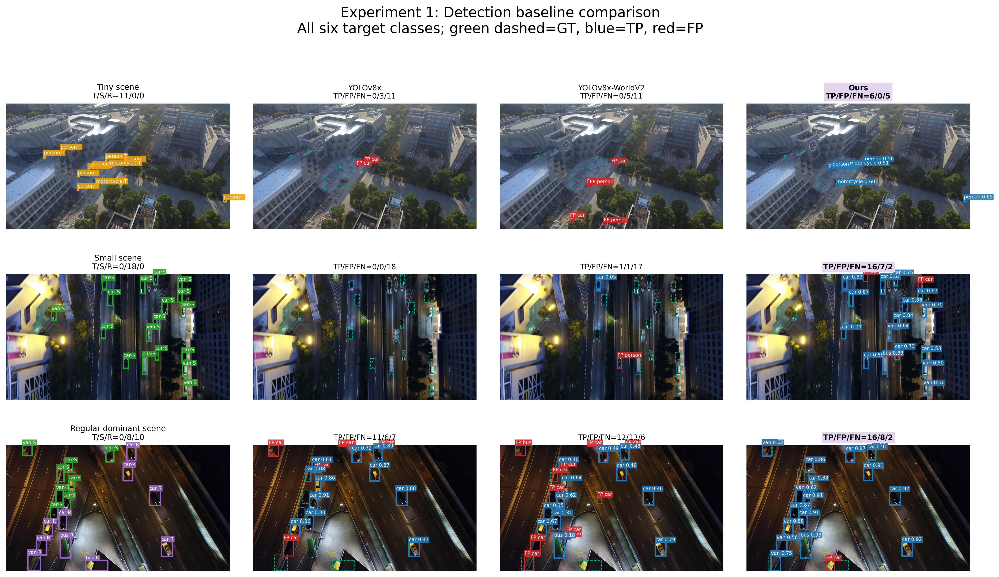

# SAM3-UAV: Replay-Aware Fine-Tuning for Language-Guided Aerial Detection and Tracking

Research code and reproducible experiment artifacts for adapting **Segment
Anything Model 3 (SAM 3)** to language-guided object detection and tracking in
unmanned-aerial-vehicle imagery. The project studies scale sensitivity,
tracking recovery, prompt specificity, and the effect of replay data during
fine-tuning. Training and replay data are drawn from VisDrone, FASDD, COCO,
and RefCOCO; prompt-specificity evaluation uses RefDrone.

This repository is built on Meta's
[official SAM 3 implementation](https://github.com/facebookresearch/sam3) and
uses [Ultralytics YOLO](https://github.com/ultralytics/ultralytics) baselines.
It is an independent research project and is not an official Meta or
Ultralytics release.



## Research scope

The evaluation is organized into three frozen experiments:

1. **Object scale — VisDrone-DET.** Compare YOLOv8x, YOLOv8x-WorldV2,
   original SAM 3, SAM 3 adapted without replay, and SAM 3 adapted with replay
   across tiny, small, and regular objects.
2. **Tracking robustness — VisDrone-MOT.** Measure frame recall, recovery rate,
   and AP50 during partial occlusion, temporary disappearance, scale changes,
   and camera motion or blur. Submitted identities must originate from the
   native SAM 3 tracker.
3. **Prompt specificity — RefDrone.** Compare category prompts, synonyms, and a
   fixed three-layer progression from category to attribute and spatial or
   relational language.

The complete metric definitions, ignored-region rules, threshold policy, and
anti-leakage constraints are frozen in
[`EXPERIMENT_PROTOCOL.md`](Master_thesis_experiments/docs/EXPERIMENT_PROTOCOL.md).

## Key results

These values are retained research artifacts rather than claims of universal
model superiority. See the linked tables for all classes, conditions, and
metrics.

| Experiment | Main observation |
|---|---|
| Object scale | Replay-adapted SAM 3 obtained the best tiny-object F1 (0.4999) and the highest recall in all three scale bins. Original SAM 3 retained the best macro AP50 (0.5943) and lowest FP/image (10.1553). |
| Tracking | Native-ID refinement achieved the strongest aggregate result: 0.4284 frame recall, 0.5125 recovery rate, and 0.4257 AP50. |
| Prompt specificity | Replay adaptation improved the category-layer F1 on the fixed 50-image subset (0.8074 versus 0.7748), but performed worse at the most specific third layer (0.1571 versus 0.2564). |

Detailed results:

- [Experiment 1 scale table](Master_thesis_experiments/tables/experiment1/experiment1_main_results.md)
- [Experiment 2 tracking table](Master_thesis_experiments/tables/experiment2/experiment2_tracking_results.md)
- [Experiment 3 prompt tables](Master_thesis_experiments/tables/experiment3/EXPERIMENT3_TABLES.md)
- [Legacy FASDD and VisDrone evaluation summaries](evaluation_results/)

## Repository layout

```text
.
├── sam3/                          Upstream SAM 3 package with local research changes
├── training/                      Multi-domain training configs and utilities
├── evaluation/                    Standalone FASDD/VisDrone evaluation package
├── Master_thesis_experiments/
│   ├── annotations/               Frozen event and prompt annotations
│   ├── configs/                   Frozen experiment and provenance configs
│   ├── data_manifests/            Deterministic dataset subsets
│   ├── docs/                      Protocol and model/data documentation
│   ├── figures/                   Small curated result figures
│   ├── results/                   Compact final metrics and reports
│   ├── scripts/                   Inference, evaluation, and figure-generation tools
│   └── tables/                    Markdown, CSV, and LaTeX thesis tables
├── evaluation_results/            Compact reports retained from earlier evaluations
├── examples/                      Upstream SAM 3 notebooks
├── scripts/                       Upstream and evaluation helper scripts
├── docs/UPSTREAM_SAM3_README.md   Snapshot of the original upstream documentation
└── pyproject.toml                 Package metadata and dependency groups
```

Large checkpoints, raw datasets, prediction dumps, videos, caches, and the old
Git object database are intentionally excluded. Their sources and SHA-256
hashes are recorded in
[`source_manifest.json`](Master_thesis_experiments/configs/source_manifest.json),
and model selection details are recorded in
[`MODEL_REGISTRY.md`](Master_thesis_experiments/docs/MODEL_REGISTRY.md).

## Requirements

The SAM 3 code path is GPU-oriented. A practical environment is:

- Linux
- Python 3.12
- PyTorch 2.7 or newer
- a CUDA-capable NVIDIA GPU
- enough GPU memory for SAM 3 inference or fine-tuning

The original code snapshot documented CUDA 12.6. Cluster training scripts in
`training/training/slurm/` were written for a specific H200/SLURM environment;
update module names, account names, paths, and resource requests before reuse.

## Installation

1. Create and activate an isolated environment:

   ```bash
   conda create -n sam3-uav python=3.12 -y
   conda activate sam3-uav
   ```

2. Install a PyTorch build compatible with the local CUDA driver. Use the
   command generated by the [official PyTorch selector](https://pytorch.org/get-started/locally/).

3. Install this package and the evaluation dependencies:

   ```bash
   pip install -e ".[train,dev,notebooks]"
   pip install -r evaluation/requirements_eval.txt
   ```

4. Request access to the
   [official SAM 3 checkpoint](https://huggingface.co/facebook/sam3), then log
   in without placing a token in source code:

   ```bash
   hf auth login
   ```

## Data and checkpoints

Downloaded data and weights must remain outside Git. The expected logical
layout is:

```text
Master_thesis_experiments/
├── datasets/raw/
│   ├── VisDrone2019-MOT-test-dev/
│   └── RefDrone/
└── models/
    ├── yolov8x-worldv2.pt
    ├── sam3_fasdd_no_replay_merged.pt
    └── sam3_stage2b_unfrozen_merged.pt
```

The VisDrone-DET root used by the original runs was stored separately and must
contain `images/` and `annotations/`. The RefDrone root must contain
`RefDrone_test_mdetr.json` and `all_image/`. Refer to
[`DATA_SOURCES.md`](Master_thesis_experiments/docs/DATA_SOURCES.md) for official
download locations.

The committed `configs/*.json` files preserve the exact paths used for the
reported experiments. They are provenance records, not portable defaults.
Copy a config and replace every dataset/checkpoint path for a new machine;
do not edit a locked config when reproducing a published run.

For the cleaned local workspace, the excluded files are stored under
`/home/alien/sam3_1/github_excluded/`. That directory must not be uploaded.

## Preflight validation

Run the preflight check before expensive inference:

```bash
cd Master_thesis_experiments
python scripts/preflight.py \
  --config configs/experiment.json \
  --output results/preflight.json
```

An empty `blocking_items` array means that the required directory structure,
model files, Python packages, and tracker-ID invariant passed the check.

Validate the standalone evaluation datasets independently:

```bash
python evaluation/validate_datasets.py \
  --visdrone-root /path/to/VisDrone2019-DET-test-dev \
  --fasdd-json /path/to/FASDD/test.json \
  --fasdd-images /path/to/FASDD/images \
  --output-dir evaluation_results/dataset_validation
```

## Running the experiments

### Experiment 1: scale-aware detection

Generate deterministic scale manifests:

```bash
cd Master_thesis_experiments
python scripts/analyze_visdrone_scales.py \
  --dataset-root /path/to/VisDrone2019-DET-test-dev \
  --output-dir results/experiment1/scale_statistics \
  --manifest-dir data_manifests/experiment1
```

The formal test evaluation uses six target categories (`car`, `person`, `bus`,
`van`, `truck`, and `motorcycle`), class-aware one-to-one matching at IoU 0.50,
VisDrone ignored-region filtering, and confidence thresholds frozen on the
548-image validation split.

### Experiment 2: event-based tracking

After updating paths in the frozen config, run:

```bash
cd Master_thesis_experiments
bash scripts/run_experiment2.sh
```

Monitor an interrupted or long run with:

```bash
bash scripts/status_experiment2.sh
```

The evaluation rejects replacement IDs presented as native tracker IDs. A
re-identification method may link native track segments only when the original
segment IDs and the derived global ID are both recorded.

### Experiment 3: prompt specificity

```bash
cd Master_thesis_experiments
bash scripts/run_experiment3.sh
python scripts/status_experiment3.py
```

The 50-example, three-layer subset is fixed in
[`specificity_50_manifest.json`](Master_thesis_experiments/annotations/experiment3/specificity_50_manifest.json).

### Earlier FASDD/VisDrone evaluation pipeline

For the standalone pipeline, inspect the available arguments first:

```bash
python evaluation/evaluate.py --help
```

Then run either dataset with explicit checkpoint and data paths. Output caches
and visualizations are ignored by Git, while compact reports can be retained.
The convenience launchers are `scripts/run_fasdd_evaluation.sh`,
`scripts/run_visdrone_evaluation.sh`, and `scripts/run_all_evaluations.sh`;
they contain machine-specific defaults and should be reviewed before use.

## Testing

The lightweight parser and metric tests do not require model checkpoints:

```bash
pytest -q evaluation/tests
```

Before publishing, verify that no oversized or sensitive files are staged:

```bash
find . -type f -size +90M -print
git status --short
git diff --cached --stat
```

GitHub blocks regular Git files larger than 100 MiB. Model weights should be
published through a model registry or a release asset only when their license
permits redistribution; raw datasets should be linked to their official host.

## Reproducibility notes

- Global random seed: `42`.
- Detection IoU threshold: `0.50`.
- Test data was not used for checkpoint, confidence-threshold, or prompt-wording
  selection.
- AP50 uses ranked, unrounded scores rather than the operating threshold used
  for F1, recall, and false-positive counts.
- Data/model provenance and hashes are retained even when binaries are not.
- Generated predictions and figures can be recreated from the frozen configs,
  manifests, and scripts.

## Publishing this cleaned copy

This directory has a fresh `main` branch, no remote, and no commits. After
revoking any previously exposed token and reviewing the files, publish it with:

```bash
git add .
git status --short
git commit -m "Initial public research release"
git remote add origin https://github.com/YOUR_ACCOUNT/YOUR_REPOSITORY.git
git push -u origin main
```

Do not restore the archived `.git` directory before publishing: it is both very
large and potentially sensitive. If this project should retain a formal link to
Meta's repository, add it after publication as a separate read-only upstream
remote:

```bash
git remote add upstream https://github.com/facebookresearch/sam3.git
```

## Security

Never commit Hugging Face tokens, API keys, private dataset credentials, or
cluster secrets. Authenticate interactively with `hf auth login` or inject
`HF_TOKEN` through the job environment. If a token has ever appeared in Git
history, revoke it before publishing; deleting it only from the latest file is
not sufficient.

## Upstream, license, and citation

The SAM 3 source files, examples, license, contribution guide, and code of
conduct originate from
[facebookresearch/sam3](https://github.com/facebookresearch/sam3). The preserved
upstream README includes the official usage examples, paper citation, and model
description: [`docs/UPSTREAM_SAM3_README.md`](docs/UPSTREAM_SAM3_README.md).

Review [`LICENSE`](LICENSE) before redistribution. If this repository or its
results are used in academic work, cite the original SAM 3 paper and the
relevant VisDrone, RefDrone, FASDD, and YOLO sources according to their official
instructions.
